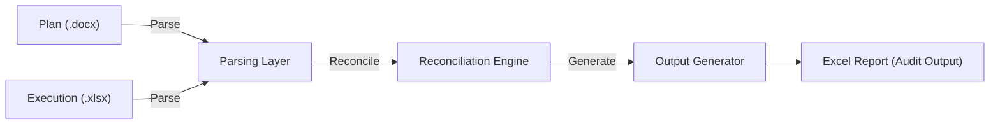
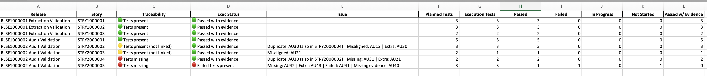

# Traceability Reconciler (v5)

## Overview

The Traceability Reconciler is a deterministic reconciliation engine
designed to validate alignment between:

-   Test Plans (intended coverage)
-   Test Execution results (actual coverage)
-   Release scope (story-level expectations)

It produces structured, audit-ready outputs to support Test Assurance,
governance reviews, and delivery confidence.

This tool is specifically designed for environments where traceability
is critical and must withstand external scrutiny (e.g. CAB, audit,
supplier handover).

------------------------------------------------------------------------

## 🔄 End-to-End Flow


**Explanation:** - Plan defines intended coverage - Execution captures
actual results - Engine reconciles differences deterministically -
Output provides audit-ready reporting

------------------------------------------------------------------------

## 📊 Example Output (Excel)

Below is a representative example of the reconciliation output format:



**Key sheets included:** - Summary (high-level status) - Traceability
Gaps (diagnostics) - Execution Detail (audit trail) - Supporting raw
data sheets

------------------------------------------------------------------------

## Why This Exists

In real delivery environments, inconsistencies frequently occur:

-   Tests planned but never executed 
-   Tests executed under the wrong story 
-   Duplicate execution across multiple stories 
-   Lack of evidence for passed tests

Manual reconciliation is slow, subjective, and error-prone.

This tool provides:

-   Objective reconciliation logic 
-   Repeatable and deterministic outputs 
-   Clear classification of issues 
-   A consistent audit trail

------------------------------------------------------------------------

## Core Concepts

Understanding these definitions is critical for interpreting outputs:

### Missing Test

A test that exists in the plan but is not executed anywhere.

### Misaligned Test

A test that was executed, but under a different story than planned.

### Extra Test

A test that was executed but does not exist in the plan for that story.

### Duplicate Test

A test executed under more than one story.

### Passed with Evidence

A test marked as passed with valid supporting evidence.

------------------------------------------------------------------------

## How to Run

From the repository root:

# Running a Test Release

This repository includes a sample release (`2026.04`) to demonstrate
end-to-end functionality.

## 1. Set up the environment

``` bash
./reset_venv.sh
```

## 2. (Optional) Regenerate the manifest

If you've modified the release contents:

``` bash
./generate_manifest.sh 2026.04
```

## 3. Run the reconciliation

``` bash
./run_release.sh 2026.04
```

## Expected behaviour

The tool will: - Load the release manifest - Parse plan and execution
files - Perform traceability reconciliation - Output results
(e.g. reports, logs)

## Advanced usage (optional)

You can run the Python entry point directly if needed:

``` bash
python run_release.py --release 2026.04
```

(Requires an active virtual environment)

Outputs will be generated in:

    outputs/YYYY.MM/

------------------------------------------------------------------------

## Inputs

Each release folder should contain:

    releases/YYYY.MM/

With:

-   One test plan file 
-   One or more execution files 
-   A manifest.json describing inputs

Example:

``` json
{
  "plan_file": "Test_Plan.xlsx",
  "execution_files": [
    "Execution_1.xlsx",
    "Execution_2.xlsx"
  ]
}
```

------------------------------------------------------------------------
## Outputs Explained (How to Read the Results)

The Excel output is the primary deliverable of the Traceability
Reconciler.\
It is designed to support both quick assessment and detailed audit.

Each sheet serves a distinct purpose and should be read in combination.

------------------------------------------------------------------------

### 1. Summary Sheet (Primary View)

**Purpose:**
Provides a high-level, story-by-story view of coverage and execution
quality.

Each row answers three key questions:

#### 1. Coverage -- *Did we test what we planned?*

Column: **Traceability**

-   🟢 Tests present
    → All planned tests were executed under the correct story

-   🟡 Tests present (not linked)
    → Tests were executed, but some are linked to the wrong story

-   🔴 Tests missing
    → One or more planned tests were not executed anywhere

------------------------------------------------------------------------

#### 2. Execution Quality -- *Did the tests pass correctly?*

Column: **Exec Status**

-   🟢 Passed with evidence
    → All executed tests passed and have supporting evidence

-   🔴 Failed tests present
    → At least one test failed

-   🟠 Mixed / Unknown
    → Execution is incomplete or inconsistent

------------------------------------------------------------------------

#### 3. Root Cause -- *What exactly is wrong?*

Column: **Issue**

This column provides the detailed breakdown:

-   **Missing** → Planned but never executed
-   **Misaligned** → Executed under the wrong story
-   **Extra** → Executed but not planned
-   **Duplicate** → Executed under multiple stories
-   **Missing evidence** → Passed but lacks supporting evidence

------------------------------------------------------------------------

#### How to interpret a row

Read across all three columns together:

-   Traceability = coverage correctness
-   Exec Status = execution outcome
-   Issue = detailed explanation

Example:

-   🟡 Traceability + 🟢 Exec Status
    → Tests passed, but traceability is incorrect

-   🔴 Traceability + 🟢 Exec Status
    → Execution looks good, but coverage is incomplete

-   🔴 Traceability + 🔴 Exec Status
    → Both coverage and execution are problematic

------------------------------------------------------------------------

### 2. Traceability Gaps Sheet (Diagnostic View)

**Purpose:**
Provides detailed analysis of where coverage breaks down.

Contains:

-   Missing Tests
-   Misaligned Tests
-   Extra Tests
-   Coverage Counts

**How to use:**

-   Use this sheet to investigate *why* a Summary row is not green
-   Misaligned tests indicate execution under the wrong story
-   Missing tests indicate true coverage gaps
-   Extra tests indicate potential scope drift

------------------------------------------------------------------------

### 3. Execution Detail Sheet (Audit View)

**Purpose:**
Provides a test-by-test audit trail.

Each row shows:

-   Planned test
-   Where it was executed
-   Whether it is aligned
-   Execution status

**Key fields:**

-   **Aligned = YES** → Executed under correct story
-   **Aligned = NO** → Executed under different story
-   **Status = NOT EXECUTED** → No execution found anywhere

**How to use:**

-   Validate specific discrepancies
-   Trace issues back to execution data
-   Support audit or review discussions

------------------------------------------------------------------------

### 4. Supporting Sheets

These provide traceability back to source data:

-   **Story_To_Test_Map** → Planned mapping of stories to tests
-   **Execution_Attachments** → Normalised execution data
-   **Plan_Raw / Exec_Raw** → Raw extracted inputs

**How to use:**

-   Verify parser behaviour
-   Troubleshoot unexpected results
-   Provide audit transparency

------------------------------------------------------------------------

## Key Interpretation Rule

The Summary sheet provides the headline view, but:

> All issues shown there can be fully explained using the Traceability
> Gaps and Execution Detail sheets.

These sheets should always be used together for complete understanding.


------------------------------------------------------------------------

## Regression Testing

The engine includes automated regression validation to guarantee
deterministic behaviour.

---

### 🔧 Setup (required before running regression)

The regression runner compares the latest output against a baseline file.

Create the required folder and copy the latest generated output:

mkdir -p tests/regression/output

cp outputs/2026.04/Traceability_Reconciliation_2026.04.xlsx \
   tests/regression/output/Traceability_Reconciliation_test.xlsx

This step ensures the regression framework has a baseline to compare against.

---

### ▶️ Run regression tests

python tests/regression/run_regression.py

---

### ⚙️ What this does

1. Executes the reconciliation engine  
2. Generates a fresh output file  
3. Compares it against the baseline  
4. Fails if any differences are detected  

---

### ✅ Expected output

Running reconciliation...

Comparing sheet: Summary
Summary matches

Comparing sheet: Traceability Gaps
Traceability Gaps matches

Comparing sheet: Execution_Detail
Execution_Detail matches

REGRESSION PASSED

---

### ❌ If it fails

- Differences will be reported in the console  
- Investigate before committing changes  
- Only update the baseline file if the change is intentional  

---

### 🧠 Notes

- The baseline file is:
  tests/regression/output/Traceability_Reconciliation_test.xlsx
- It represents the expected output for the engine  
- Update it only when behaviour changes are deliberate  
- The mkdir step is safe to run repeatedly  

------------------------------------------------------------------------

## Design Principles

-   Normalise once at ingestion 
-   Deterministic outputs 
-   Separation of concerns (parser → engine → writer) 
-   Data-driven behaviour 
-   Audit-first design

------------------------------------------------------------------------

## Assumptions & Known Behaviours

### Assumptions

-   Input files follow expected formats 
-   Story identifiers follow pattern (e.g. STRYxxxx) 
-   Test IDs are unique identifiers 
-   Execution files contain consistent status values

------------------------------------------------------------------------

### Known Behaviours

-   Misaligned tests are treated as coverage gaps 
-   Duplicate tests are reported but not automatically resolved 
-   Evidence is treated as a binary flag (yes/no) 
-   Output ordering may differ but data remains consistent

------------------------------------------------------------------------

## Limitations

-   Relies on consistent naming conventions 
-   Does not infer missing relationships automatically 
-   Does not validate business logic correctness of tests

------------------------------------------------------------------------

## Maintainer Guidance

-   Always run regression tests before committing 
-   Do not introduce implicit data transformations 
-   Prefer configuration over logic changes 
-   Treat output structure as contract

------------------------------------------------------------------------

# Project Utilities

## reset_venv.sh

Recreates the project's Python virtual environment from scratch.

-   Deletes any existing `.venv`
-   Creates a fresh virtual environment
-   Upgrades core packaging tools (`pip`, `setuptools`, `wheel`)
-   Installs dependencies from `requirements.txt`

Use this when: - setting up the project for the first time -
dependencies become inconsistent - switching environments

Example: ./reset_venv.sh

## run_release.sh

Convenience wrapper to execute a release reconciliation run.

-   Activates the project's virtual environment
-   Calls `run_release.py` with the provided release ID

Ensures consistent execution without requiring manual environment setup.

Example: ./run_release.sh 2026.04

## generate_manifest.sh

Automatically generates a `manifest.json` for a given release.

-   Validates required folder structure:
    -   `plan/`
    -   `execution/`
-   Selects the most recent `.docx` file as the plan
-   Collects all `.xlsx` execution files
-   Writes a structured manifest with relative paths

This removes the need to manually maintain manifest files and ensures
consistency.

Example: ./generate_manifest.sh 2026.04


## Summary

This tool is designed to be:

-   Deterministic 
-   Transparent 
-   Auditable 
-   Safe to evolve

It should be treated as a controlled component within the delivery
process, not a disposable script.


