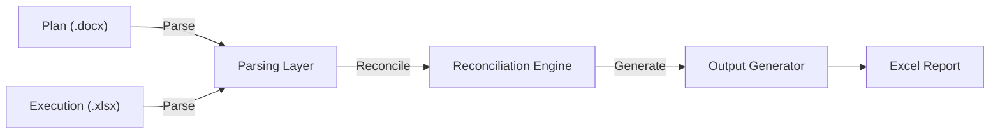

# Traceability Reconciler (v5)

## Overview

The Traceability Reconciler is a deterministic reconciliation engine that validates alignment between:

- Test Plans / Specifications
- Test Execution Results
- Release Scope

It produces structured, audit-ready outputs suitable for governance reviews, CABs, supplier handover and audit activities.

---

# 🚀 Quick Start

## macOS / Linux

```bash
git clone https://github.com/dwatkin3/traceability-tooling.git
cd traceability-tooling

chmod +x *.sh

./create_regression_evidence.sh
./bootstrap.sh 2026.04
./validate.sh 2026.04
```

## Windows (Git Bash)

```bash
git clone https://github.com/dwatkin3/traceability-tooling.git
cd traceability-tooling

./create_regression_evidence.sh
./bootstrap.sh 2026.04
./validate.sh 2026.04
```

## Common Commands

| Action | Command |
|----------|----------|
| Validate release | `./validate.sh 2026.04` |
| Clean rebuild + validate | `./bootstrap.sh 2026.04` |
| Update baseline | `./validate.sh 2026.04 --update-baseline` |
| Archive previous output | `./validate.sh 2026.04 --archive` |

---

# 📥 Inputs

Each release contains:

```text
releases/YYYY.MM/
```

- One or more specification documents (.docx)
- One or more execution workbooks (.xlsx)
- A manifest.json describing inputs

Supports:
- Single-spec releases
- Multi-spec releases
- Multiple execution workbooks
- Descriptive or RLSE release identifiers

---

# 📤 Outputs

The generated workbook contains:

| Sheet | Purpose |
|---------|---------|
| Dashboard | Executive summary |
| Summary | Story-level reconciliation |
| Traceability Gaps | Diagnostic view |
| Execution Detail | Audit trail |
| Traceability Matrix | Canonical flattened dataset |
| Supporting Sheets | Parser and source transparency |

## Dashboard

Provides:
- Planned stories
- Executed stories
- Coverage %
- Failed tests
- Missing tests
- Misaligned tests

## Summary

Primary governance view showing:

- Coverage status
- Execution status
- Root cause analysis

## Traceability Gaps

Used to investigate:
- Missing tests
- Misaligned tests
- Extra tests
- Duplicate tests

## Execution Detail

Provides a test-by-test audit trail.

## Traceability Matrix

Flattened machine-readable dataset designed for:

- Audit analysis
- Power BI
- Governance reporting
- Downstream tooling

---

# 🧪 Regression Testing

Regression testing is fully integrated.

```bash
./validate.sh 2026.04
```

Each run compares:

```text
outputs/YYYY.MM/Traceability_Reconciliation_YYYY.MM.xlsx
vs
tests/regression/baseline/Traceability_Reconciliation_YYYY.MM.xlsx
```

To intentionally update the baseline:

```bash
./validate.sh 2026.04 --update-baseline
```

Regression validates:

- Summary
- Traceability Gaps
- Execution Detail
- Dashboard
- Traceability Matrix
- Hyperlinks
- Filters
- Freeze panes

---

# 🔄 End-to-End Flow



---

# Core Concepts

- Missing Test – planned but not executed
- Misaligned Test – executed under the wrong story
- Extra Test – executed but not planned
- Duplicate Test – executed under multiple stories
- Passed with Evidence – passed with supporting evidence

---

# Recent Enhancements

## Multi-Document Releases

Supports:
- Multiple specifications
- Multiple execution workbooks
- Mixed release identifiers

## Expanded Test ID Support

Supports:

- AU12
- IS01A
- TP-CREW-01
- TP-OPT-01
- AU01-AU05
- IS70A-D

## Dashboard Sheet

Governance-focused summary metrics.

## Traceability Matrix

Canonical flattened audit dataset.

## Workbook Navigation

- Filters
- Freeze panes
- Hyperlinks
- Auto-sizing

---

# Utilities

## bootstrap.sh

Creates a clean environment and validates a release.

## validate.sh

Runs reconciliation and regression validation.

## generate_manifest.sh

Generates release manifests automatically.

## reset_venv.sh

Rebuilds the Python virtual environment.

## run_release.sh

Direct execution wrapper around run_release.py.

---

# Design Principles

- Deterministic outputs
- Audit-first design
- Separation of concerns
- Minimal implicit behaviour
- Transparent reconciliation

---

# Maintainer Notes

- Run regression before committing
- Treat workbook structure as a contract
- Understand differences before updating baselines
- Prefer configuration over hidden logic
